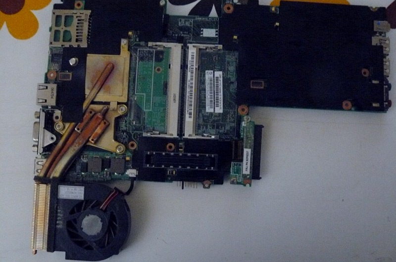
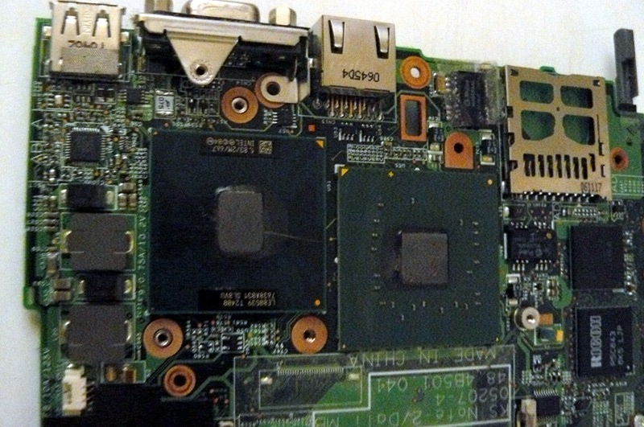

% Changing the fan/heatsink on the ThinkPad X60

This guide will teach you how to replace the fan and heatsink on your
ThinkPad X60.

Table of Contents
=================

-   [Hardware Requirements](#hardware_requirements)
-   [Software Requirements](#software_requirements)
-   [Disassembly](#procedure)

Hardware requirements {#hardware_requirements}
=====================

-   isopropyl alcohol (sometimes called rubbing alcohol)
-   your new fan and/or heatsink
-   CPU thermal compound (some say Arctic MX-4 is good, others are also
    'ok')
-   Something to spread the paste with

Software requirements (for CPU stress testing) {#software_requirements}
==============================================

-   xsensors utility
-   stress utility

Disassembly {#procedure}
===========

Remove those screws:\

Push the keyboard forward (carefully):\

Lift the keyboard up and disconnect it from the board:\

Grab the right-hand side of the chassis and force it off (gently) and
pry up the rest of the chassis:\

You should now have this:\

Disconnect the wifi antenna cables, the modem cable and the speaker:\

Unroute the cables along their path, carefully lifting the tape that
holds them in place. Then, disconnect the modem cable (other end) and
power connection and unroute all the cables so that they dangle by the
monitor hinge on the right-hand side:\

Disconnect the monitor from the motherboard, and unroute the grey
antenna cable, carefully lifting the tape that holds it into place:\

Carefully lift the remaining tape and unroute the left antenna cable so
that it is loose:\

Remove those screws:\

Remove those screws:\

Carefully remove the plate, like so:\

Remove the SATA connector:\

Now remove the motherboard (gently) and cast the lcd/chassis aside:\

Look at that black tape above the heatsink, remove it:\

Now you have removed it:\

Disconnect the fan and remove all the screws, heatsink will easily come
off:\

Remove the old paste with a cloth (from the CPU and heatsink) and then
clean both of them with the alcohol (to remove remaining residue of the
paste). Apply a pea-sized amount of paste to the both chipsets that the
heatsink covered and spread it evenly (uniformally). Finally reinstall
the heatsink, reversing previous steps.

**stress -c 2** command can be used to push the CPU to 100%, and
**xsensors** (or **watch sensors** command) can be used to monitor heat.
Below 90C is ok.

Copyright © 2014, 2015 Leah Rowe <info@minifree.org>\
Permission is granted to copy, distribute and/or modify this document
under the terms of the Creative Commons Attribution-ShareAlike 4.0
International license or any later version published by Creative
Commons; A copy of the license can be found at
[../cc-by-sa-4.0.txt](../cc-by-sa-4.0.txt)

Updated versions of the license (when available) can be found at
<https://creativecommons.org/licenses/by-sa/4.0/legalcode>

UNLESS OTHERWISE SEPARATELY UNDERTAKEN BY THE LICENSOR, TO THE EXTENT
POSSIBLE, THE LICENSOR OFFERS THE LICENSED MATERIAL AS-IS AND
AS-AVAILABLE, AND MAKES NO REPRESENTATIONS OR WARRANTIES OF ANY KIND
CONCERNING THE LICENSED MATERIAL, WHETHER EXPRESS, IMPLIED, STATUTORY,
OR OTHER. THIS INCLUDES, WITHOUT LIMITATION, WARRANTIES OF TITLE,
MERCHANTABILITY, FITNESS FOR A PARTICULAR PURPOSE, NON-INFRINGEMENT,
ABSENCE OF LATENT OR OTHER DEFECTS, ACCURACY, OR THE PRESENCE OR ABSENCE
OF ERRORS, WHETHER OR NOT KNOWN OR DISCOVERABLE. WHERE DISCLAIMERS OF
WARRANTIES ARE NOT ALLOWED IN FULL OR IN PART, THIS DISCLAIMER MAY NOT
APPLY TO YOU.

TO THE EXTENT POSSIBLE, IN NO EVENT WILL THE LICENSOR BE LIABLE TO YOU
ON ANY LEGAL THEORY (INCLUDING, WITHOUT LIMITATION, NEGLIGENCE) OR
OTHERWISE FOR ANY DIRECT, SPECIAL, INDIRECT, INCIDENTAL, CONSEQUENTIAL,
PUNITIVE, EXEMPLARY, OR OTHER LOSSES, COSTS, EXPENSES, OR DAMAGES
ARISING OUT OF THIS PUBLIC LICENSE OR USE OF THE LICENSED MATERIAL, EVEN
IF THE LICENSOR HAS BEEN ADVISED OF THE POSSIBILITY OF SUCH LOSSES,
COSTS, EXPENSES, OR DAMAGES. WHERE A LIMITATION OF LIABILITY IS NOT
ALLOWED IN FULL OR IN PART, THIS LIMITATION MAY NOT APPLY TO YOU.

The disclaimer of warranties and limitation of liability provided above
shall be interpreted in a manner that, to the extent possible, most
closely approximates an absolute disclaimer and waiver of all liability.

