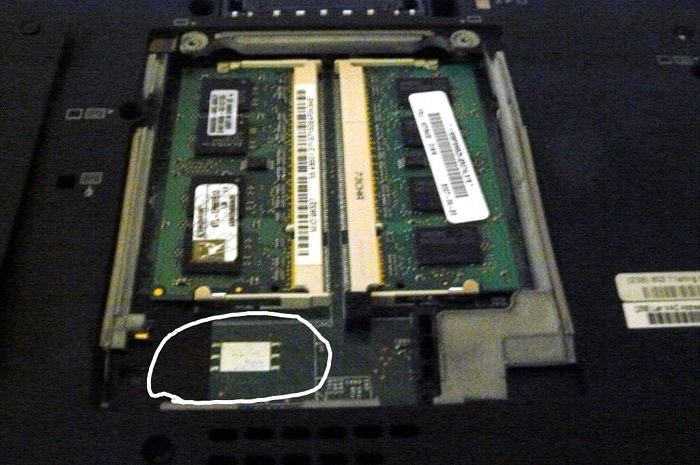
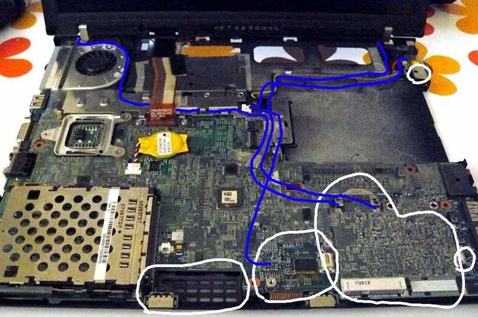
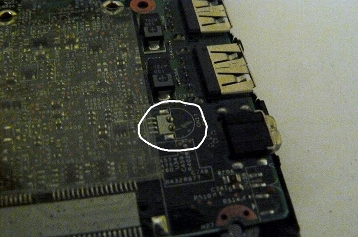

% Security on the ThinkPad X60

Hardware modifications to enhance security on the ThinkPad X60. This
tutorial is **incomplete** at the time of writing.

[Back to previous index](./)

Table of Contents
=================

-   [Hardware Requirements](#hardware_requirements)
-   [Software Requirements](#software_requirements)
-   [The procedure](#procedure)

Hardware requirements {#hardware_requirements}
=====================

-   An X60
-   screwdriver
-   (in a later version of this tutorial: soldering iron and scalpel)

Software requirements {#software_requirements}
=====================

-   none (at least in the scope of the article as-is)
-   You probably want to encrypt your GNU+Linux install using LUKS

Rationale
=========

Most people think of security on the software side: the hardware is
important aswell.

This tutorial deals with reducing the number of devices that have direct
memory access that could communicate with inputs/outputs that could be
used to remotely command the system (or leak data). All of this is
purely theoretical for the time being.

Disassembly {#procedure}
===========

Firstly remove the bluetooth (if your X60 has this):\
The marked screws are underneath those stickers (marked in those 3
locations at the bottom of the LCD assembly):\
\
Now gently pry off the bottom part of the front bezel, and the bluetooth
module is on the left (easily removable):\
\

If your model was WWAN, remove the simcard (check anyway):\
Uncover those 2 screws at the bottom:\
\
SIM card (not present in the picture) is in the marked location:\
\
Replacement: USB dongle.

Now get into the motherboard.

Remove those screws:\

Push the keyboard forward (carefully):\

Lift the keyboard up and disconnect it from the board:\

Grab the right-hand side of the chassis and force it off (gently) and
pry up the rest of the chassis:\

You should now have this:\

The following is a summary of what you will remove (already done to this
system):\
\
Note: the blue lines represent antenna cables and modem cables. You
don't need to remove these, but you can if you want (to make it tidier
after removing other parts). I removed the antenna wires, the modem
jack, the modem cable and also (on another model) a device inside the
part where the wwan antenna goes (wasn't sure what it was, but I knew
it wasn't needed). **This is optional**

Remove the microphone (can desolder it, but you can also easily pull it
off with you hands). Already removed here:\
\
**Rationale:**\
Another reason to remove the microphone: If your computer
gets[\[1\]](#ref1) compromised, it can record what you say, and use it
to receive data from nearby devices if they're compromised too. Also,
we do not know what the built-in microcode (in the CPU) is doing; it
could theoretically be programmed to accept remote commands from some
speaker somewhere (remote security hole). **In other words, the system
could already be compromised from the factory.**

Remove the modem:\
\
(useless, obsolete device)

Remove the speaker:\
\
Reason: combined with the microphone issue, this could be used to leak
data.\
If your computer gets[\[1\]](#ref1) compromised, it can be used to
transmit data to nearby compromised devices. It's unknown if it can be
turned into a microphone[\[2\]](#ref2).\
Replacement: headphones/speakers (line-out) or external DAC (USB).

Remove the wlan (also remove wwan if you have it):\
\
Reason: has direct (and very fast) memory access, and could
(theoretically) leak data over a side-channel.\
**Wifi:** The ath5k/ath9k cards might not have firmware at all. They
might safe but could have access to the computer's RAM trough DMA. If
people have an intel card(most X60s come with Intel wifi by default,
until you change it),then that card runs a non-free firwamre and has
access to the computer's RAM trough DMA! So the risk-level is very
high.\
**Wwan (3g modem):** They run proprietary software! It's like AMT but
over the GSM network which is probably even worse.\
Replacement: external USB wifi dongle. (or USB wwan/3g dongle; note,
this has all the same privacy issues as mobile phones. wwan not
recommended).

Not covered yet:
----------------

-   Disable cardbus (has fast/direct memory access)
-   Disable firewire (has fast/direct memory access)
-   Disable flashing the ethernet firmware
-   Disable SPI flash writes (can be re-enabled by unsoldering two
    parts)

-   Disable use of xrandr/edid on external monitor (cut 2 pins on VGA)
-   Disable docking station (might be possible to do it in software, in
    coreboot upstream as a Kconfig option)

Go to
<http://media.ccc.de/browse/congress/2013/30C3_-_5529_-_en_-_saal_2_-_201312271830_-_hardening_hardware_and_choosing_a_goodbios_-_peter_stuge.html>
or directly to the video:
<http://mirror.netcologne.de/CCC/congress/2013/webm/30c3-5529-en-Hardening_hardware_and_choosing_a_goodBIOS_webm.webm>.

A lot of this tutorial is based on that video. Look towards the second
half of the video to see how to do the above.

Also not covered yet:
---------------------

-   Intrusion detection: randomized seal on screws

    Just put nail polish with lot of glider on the important screws,
    take some good pictures. Keep the pictueres and make sure of their
    integrity. Compare the nail polish with the pictures before powering
    on the laptop.
-   Tips about preventing/mitigating risk of cold boot attack.
    -   soldered RAM?
    -   seal RAM door shut (possibly modified lower chassis) so that
        system has to be disassembled (which has to go through the nail
        polish)
    -   wipe all RAM at boot/power-off/power-on? (patch in coreboot
        upstream?)
    -   ask gnutoo about fallback patches (counts number of boots)
-   General tips/advice and web links showing how to detect physical
    intrusions.
-   For example: <http://cs.tau.ac.il/~tromer/acoustic/> or
    <http://cyber.bgu.ac.il/content/how-leak-sensitive-data-isolated-computer-air-gap-near-mobile-phone-airhopper>.
-   <https://en.wikipedia.org/wiki/Tempest_%28codename%29>
-   https://gitorious.org/gnutoo-for-coreboot/grub-assemble/source/a61f636797777a742f65f4c9c58032aa6a9b23c3:

Extra notes
===========

EC: Cannot be removed but can be mitigated: it contains non-free
non-loadable code, but it has no access to the computer's RAM. It has
access to the on-switch of the wifi, bluetooth, modem and some other
power management features. The issue is that it has access to the
keyboard, however if the software security howto **(not yet written)**
is followed correctly, it won't be able to leak data to a local
attacker. It has no network access but it may still be able to leak data
remotely, but that requires someone to be nearby to recover the data
with the help of an SDR and some directional antennas[\[3\]](#ref3).

[Intel 82573 Ethernet
controller](http://www.coreboot.org/Intel_82573_Ethernet_controller) on
the X60 seems safe, according to Denis.

Risk level
----------

-   Modem (3g/wwan): highest
-   Intel wifi: Near highest
-   Atheros PCI wifi: unknown, but lower than intel wifi.
-   Microphone: only problematic if the computer gets compromised.
-   Speakers: only problematic if the computer gets compromised.
-   EC: can be mitigated if following the guide on software security.

Further reading material (software security)
============================================

-   [Installing Debian or Devuan GNU+Linux with full disk encryption
    (including /boot)](../gnulinux/encrypted_debian.html)
-   [Installing Parabola GNU+Linux with full disk encryption (including
    /boot)](../gnulinux/encrypted_parabola.html)
-   [Notes about DMA access and the docking station](dock.html)

References
==========

\[1\] physical access {#ref1}
---------------------

Explain that black hats, TAO, and so on might use a 0day to get in, and
explain that in this case it mitigates what the attacker can do. Also
the TAO do some evaluation before launching an attack: they take the
probability of beeing caught into account, along with the kind of
target. A 0day costs a lot of money, I heard that it was from 100000\$
to 400000\$, some other websites had prices 10 times lower but that but
it was probably a typo. So if people increase their security it makes it
more risky and more costly to attack people.

\[2\] microphone {#ref2}
----------------

It's possible to turn headphones into a microphone, you could try
yourself, however they don't record loud at all. Also intel cards have
the capability to change a connector's function, for instance the
microphone jack can now become a headphone plug, that's called
retasking. There is some support for it in GNU+Linux but it's not very
well known.

\[3\] Video (CCC) {#ref3}
-----------------

30c3-5356-en-Firmware\_Fat\_Camp\_webm.webm from the 30th CCC. While
their demo is experimental(their hardware also got damaged during the
transport), the spies probably already have that since a long time.
<http://berlin.ftp.media.ccc.de/congress/2013/webm/30c3-5356-en-Firmware_Fat_Camp_webm.webm>

Copyright © 2014, 2015 Leah Rowe <info@minifree.org>\
Permission is granted to copy, distribute and/or modify this document
under the terms of the Creative Commons Attribution-ShareAlike 4.0
International license or any later version published by Creative
Commons; A copy of the license can be found at
[../cc-by-sa-4.0.txt](../cc-by-sa-4.0.txt)

Updated versions of the license (when available) can be found at
<https://creativecommons.org/licenses/by-sa/4.0/legalcode>

UNLESS OTHERWISE SEPARATELY UNDERTAKEN BY THE LICENSOR, TO THE EXTENT
POSSIBLE, THE LICENSOR OFFERS THE LICENSED MATERIAL AS-IS AND
AS-AVAILABLE, AND MAKES NO REPRESENTATIONS OR WARRANTIES OF ANY KIND
CONCERNING THE LICENSED MATERIAL, WHETHER EXPRESS, IMPLIED, STATUTORY,
OR OTHER. THIS INCLUDES, WITHOUT LIMITATION, WARRANTIES OF TITLE,
MERCHANTABILITY, FITNESS FOR A PARTICULAR PURPOSE, NON-INFRINGEMENT,
ABSENCE OF LATENT OR OTHER DEFECTS, ACCURACY, OR THE PRESENCE OR ABSENCE
OF ERRORS, WHETHER OR NOT KNOWN OR DISCOVERABLE. WHERE DISCLAIMERS OF
WARRANTIES ARE NOT ALLOWED IN FULL OR IN PART, THIS DISCLAIMER MAY NOT
APPLY TO YOU.

TO THE EXTENT POSSIBLE, IN NO EVENT WILL THE LICENSOR BE LIABLE TO YOU
ON ANY LEGAL THEORY (INCLUDING, WITHOUT LIMITATION, NEGLIGENCE) OR
OTHERWISE FOR ANY DIRECT, SPECIAL, INDIRECT, INCIDENTAL, CONSEQUENTIAL,
PUNITIVE, EXEMPLARY, OR OTHER LOSSES, COSTS, EXPENSES, OR DAMAGES
ARISING OUT OF THIS PUBLIC LICENSE OR USE OF THE LICENSED MATERIAL, EVEN
IF THE LICENSOR HAS BEEN ADVISED OF THE POSSIBILITY OF SUCH LOSSES,
COSTS, EXPENSES, OR DAMAGES. WHERE A LIMITATION OF LIABILITY IS NOT
ALLOWED IN FULL OR IN PART, THIS LIMITATION MAY NOT APPLY TO YOU.

The disclaimer of warranties and limitation of liability provided above
shall be interpreted in a manner that, to the extent possible, most
closely approximates an absolute disclaimer and waiver of all liability.

