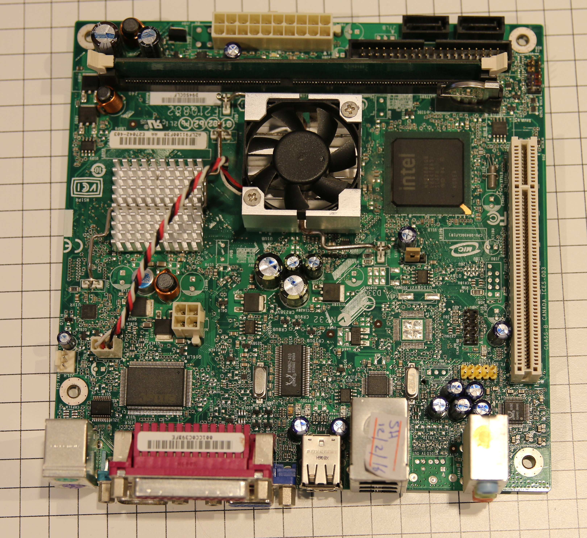

% Intel D945GCLF desktop board 

If you just want flashing instructions, go to
[../install/d945gclf.html](https://libreboot.org/docs/install/d945gclf.html)

This board is a mini-itx desktop board for 2008. It uses an atom 230,
which is a singe core CPU but it is hyperthreaded so it appears to have
2 thread to the OS. The flash chip is very small, 512KiB, so grub2 does
not fit, which is why libreboot has to use seabios on this target. Full
disk encryption like on other supported targets will not be possible, so
plan accordingly.

This board has a 945gc chipset which is the desktop equivalent of 945gm
which can be found in the Lenovo x60/t60 or macbook2,1. This chipset
features an ICH7 southbridge. It has 1 DIMM slot that can accommodate up
to 2G of DDR2 RAM.

Connectivity-wise it has 1 PCI slot, a 10/100 ethernet port, 4 usb slot
and 4 usb ports, with one internal header and 2 SATA ports.

The D945GCLF2 is an upgraded version of this board. The differences are:
1 more USB header, 10/100/1000 ethernet and a dual core cpu (also
hyperthreaded). Since the board is almost identical (and coreboot code
seem to indicate that it works, since MAX\_CPU=4 is set), it is believed
that it should also work but this is untested.

Remarks about vendor bios:
--------------------------

-   Without coreboot/libreboot this board is utery useless, since the
    vendor bios is very bad. It cannot boot from any HDD wether it is
    connected to the SATA port or USB. With libreboot it works just
    fine.

-   The vendor bios write protects the flash so it requires external
    flashing to install libreboot on this device. Once libreboot is
    flashed there is no problem to update the firmware internally

Here is an image of the board:\
\
Here is an image of the D945GCLF2 board:\
{width="80%" height="80%"}\
And SPI SOIC8 flash chip\
{width="50%" height="50%"}

How to replace thermal paste and fan
------------------------------------

This board comes with very crappy disposable loud fan, that one has no
bearings, which can not be repaired or oiled properly, do not waste your
time trying to fix it, just buy one chinese same size fan\
{width="50%" height="50%"}
{width="50%" height="50%"}\
Make sure that new one has same wiring\
{width="50%" height="50%"}\
This is a new one, with bearing and maintenable\
{width="50%" height="50%"}
{width="50%" height="50%"}\
Now remove the both coolers rotating them a bit, slowly, then clean both
silicons and both coolers (removing cmos battery first is recommended)\
{width="50%" height="50%"}\
Put a little bit of non conductive thermal paste on both silicons (only
cpu silicon iis shown on that image)\
{width="50%" height="50%"}\

Before assembling new fan, some need new longer screws, make sure having
these (on the left is original one, too short for new fan)\
{width="50%" height="50%"}\
After that, assemble your new fan into CPU cooler\
{width="50%" height="50%"}\
Finally assemle both coolers on both chips, do not forget put in the CPU
fan connector back, and you are done.

Copyright © 2016 Arthur Heymans <arthur@aheymans.xyz>\
Copyright © 2016 Vitaly Castaño Solana <vita\_cell@hotmail.com>\
Permission is granted to copy, distribute and/or modify this document
under the terms of the Creative Commons Attribution-ShareAlike 4.0
International license or any later version published by Creative
Commons; A copy of the license can be found at
[../cc-by-sa-4.0.txt](https://libreboot.org/docs/cc-by-sa-4.0.txt)

Updated versions of the license (when available) can be found at
<https://creativecommons.org/licenses/by-sa/4.0/legalcode>

UNLESS OTHERWISE SEPARATELY UNDERTAKEN BY THE LICENSOR, TO THE EXTENT
POSSIBLE, THE LICENSOR OFFERS THE LICENSED MATERIAL AS-IS AND
AS-AVAILABLE, AND MAKES NO REPRESENTATIONS OR WARRANTIES OF ANY KIND
CONCERNING THE LICENSED MATERIAL, WHETHER EXPRESS, IMPLIED, STATUTORY,
OR OTHER. THIS INCLUDES, WITHOUT LIMITATION, WARRANTIES OF TITLE,
MERCHANTABILITY, FITNESS FOR A PARTICULAR PURPOSE, NON-INFRINGEMENT,
ABSENCE OF LATENT OR OTHER DEFECTS, ACCURACY, OR THE PRESENCE OR ABSENCE
OF ERRORS, WHETHER OR NOT KNOWN OR DISCOVERABLE. WHERE DISCLAIMERS OF
WARRANTIES ARE NOT ALLOWED IN FULL OR IN PART, THIS DISCLAIMER MAY NOT
APPLY TO YOU.

TO THE EXTENT POSSIBLE, IN NO EVENT WILL THE LICENSOR BE LIABLE TO YOU
ON ANY LEGAL THEORY (INCLUDING, WITHOUT LIMITATION, NEGLIGENCE) OR
OTHERWISE FOR ANY DIRECT, SPECIAL, INDIRECT, INCIDENTAL, CONSEQUENTIAL,
PUNITIVE, EXEMPLARY, OR OTHER LOSSES, COSTS, EXPENSES, OR DAMAGES
ARISING OUT OF THIS PUBLIC LICENSE OR USE OF THE LICENSED MATERIAL, EVEN
IF THE LICENSOR HAS BEEN ADVISED OF THE POSSIBILITY OF SUCH LOSSES,
COSTS, EXPENSES, OR DAMAGES. WHERE A LIMITATION OF LIABILITY IS NOT
ALLOWED IN FULL OR IN PART, THIS LIMITATION MAY NOT APPLY TO YOU.

The disclaimer of warranties and limitation of liability provided above
shall be interpreted in a manner that, to the extent possible, most
closely approximates an absolute disclaimer and waiver of all liability.

