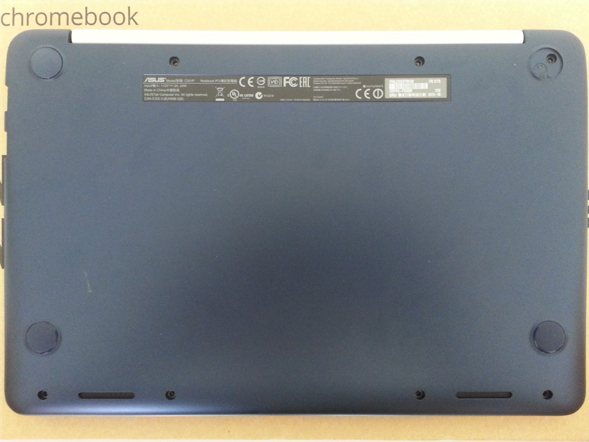

ASUS Chromebook C201 installation guide 
=======================================

These instructions are for installing Libreboot to the ASUS Chromebook
C201. Since the device ships with Coreboot, the installation
instructions are the same before and after flashing Libreboot for the
first time.

**If you are using libreboot\_src or git, then make sure that you built
the sources first (see [../git/\#build](../git/#build)).**

Look at the [list of ROM images](#rom) to see which image is compatible
with your device.

Libreboot can be installed internally from the device, with sufficient
privileges. The installation process requires using **Google's modified
version of flashrom**, that has support for reflashing the Chromebook's
SPI flash. Otherwise, flashing externally will work with the upstream
flashrom version.

**Google's modified version of flashrom** is free software and its
source code is made available by Google:
[flashrom](https://chromium.googlesource.com/chromiumos/third_party/flashrom/).\
It is not distributed along with Libreboot yet. However, it is
preinstalled on the device, with ChromeOS.

Installing Libreboot internally requires sufficient privileges on the
system installed on the device.\
When the device has ChromeOS installed (as it does initially), it is
necessary to gain root privileges in ChromeOS, to be able to access a
root shell.

-   [Gaining root privileges on ChromeOS](#root_chromeos)
-   [Preparing the device for the installation](#preparing_device)
    -   [Configuring verified boot
        parameters](#configuring_verified_boot_parameters)
    -   [Removing the write protect
        screw](#removing_write_protect_screw)
-   [Installing Libreboot to the SPI flash]()
    -   [Installing Libreboot internally, from the
        device](#installing_libreboot_internally)
    -   [Installing Libreboot externally, with a SPI flash
        programmer](#installing_libreboot_externally)
-   [Debian GNU+Linux is recommended for this device](#debian) (TODO:
    instructions for Devuan)

Gaining root privileges on ChromeOS
In order to gain root privileges on ChromeOS, developer mode has to be
enabled from the recovery mode screen and debugging features have to be
enabled in ChromeOS.

Instructions to access the [recovery mode
screen](../depthcharge/#recovery_mode_screen) and [enabling developer
mode](../depthcharge/#enabling_developer_mode) are available on the page
dedicated to [depthcharge](../depthcharge/).

Once developer mode is enabled, the device will boot to the [developer
mode screen](../depthcharge/#developer_mode_screen). ChromeOS can be
booted by waiting for 30 seconds (the delay is shortened in Libreboot)
or by pressing **Ctrl + D**

After the system has booted, root access can be enabled by clicking on
the **Enable debugging features** link. A confirmation dialog will ask
whether to proceed.\
After confirming by clicking **Proceed**, the device will reboot and ask
for the root password to set. Finally, the operation has to be confirmed
by clicking **Enable**.

After setting the root password, it becomes possible to log-in as root.
A tty prompt can be obtained by pressing **Ctrl + Alt + Next**. The
**Next** key is the one on the top left of the keyboard.

Preparing the device for the installation
Before installing Libreboot on the device, both its software and
hardware has to be prepared to allow the installation procedure and to
ensure that security features don't get in the way.

Configuring verified boot parameters {#configuring_verified_boot_parameters}
------------------------------------

It is recommended to have access to the [developer mode
screen](../depthcharge/#developer_mode_screen) and to [configure the
following verified boot
parameters](../depthcharge/#configuring_verified_boot_parameters):

-   Kernels signature verification: *disabled*
-   External media boot: *enabled*

Those changes can be reverted later, when the device is known to be in a
working state.

Removing the write protect screw {#removing_write_protect_screw}
--------------------------------

Since part of the SPI flash is write-protected by a screw, it is
necessary to remove the screw to remove the write protection and allow
writing Libreboot to the *read-only* part of the flash.

To access the screw, the device has to be opened. There are 8 screws to
remove from the bottom of the device, as shown on the picture below. Two
are hidden under the top pads. After removing the screws, the keyboard
plastic part can be carefully detached from the rest. **Beware: there
are cables attached to it!** It is advised to flip the keyboard plastic
part over, as shown on the picture below. The write protect screw is
located next to the SPI flash chip, circled in red in the picture below.
It has to be removed.

 

The write protect screw can be put back in place later, when the device
is known to be in a working state.

Installing Libreboot to the SPI flash {#installing_libreboot_spi_flash}
=====================================

The SPI flash (that holds Libreboot) is divided into various partitions
that are used to implement parts of the CrOS security system. Libreboot
is installed in the *read-only* coreboot partition, that becomes
writable after removing the write-protect screw.

Installing Libreboot internally, from the device {#installing_libreboot_internally}
------------------------------------------------

Before installing Libreboot to the SPI flash internally, the device has
to be reassembled.

All the files from the **veyron\_speedy** release (or build) have to be
transferred to the device.

The following operations have to be executed with root privileges on the
device (e.g. using the *root* account). In addition, the
**cros-flash-replace** script has to be made executable:\
\# **chmod a+x cros-flash-replace**\

The SPI flash has to be read first:\
\# **flashrom -p host -r flash.img**\
**Note: it might be a good idea to copy the produced flash.img file at
this point and store it outside of the device for backup purposes.**

Then, the **cros-flash-replace** script has to be executed as such:\
\# **./cros-flash-replace flash.img coreboot ro-frid**\
If any error is shown, it is definitely a bad idea to go further than
this point.

The resulting flash image can then be flashed back:\
\# **flashrom -p host -w flash.img**\

You should also see within the output the following:\
**"Verifying flash\... VERIFIED."**

Shut down. The device will now boot to Libreboot.

Installing Libreboot externally, with a SPI flash programmer {#installing_libreboot_externally}
------------------------------------------------------------

Before installing Libreboot to the SPI flash internally, the device has
to be opened.

The SPI flash is located next to the write protect screw. Its layout is
indicated in the picture below. Note that it is not necessary to connect
**WP\#** since removing the screw already connects it to ground. Before
writing to the chip externally, the battery connector has to be
detached. It is located under the heat spreader, that has to be
unscrewed from the rest of the case. The battery connector is located on
the right and has colorful cables, as shown on the picture below.

All the files from the **veyron\_speedy** release (or build) have to be
transferred to the host.

The following operations have to be executed with root privileges on the
host (e.g. using the *root* account). In addition, the
**cros-flash-replace** script has to be made executable:\
\# **chmod a+x cros-flash-replace**\

The SPI flash has to be read first (using the right spi programmer):\
\# **flashrom -p *programmer* -r flash.img**\
**Note: it might be a good idea to copy the produced flash.img file at
this point and store it outside of the device for backup purposes.**

Then, the **cros-flash-replace** script has to be executed as such:\
\# **./cros-flash-replace flash.img coreboot ro-frid**\
If any error is shown, it is definitely a bad idea to go further than
this point.

The resulting flash image can then be flashed back (using the right spi
programmer):\
\# **flashrom -p *programmer* -w flash.img**\

You should also see within the output the following:\
**"Verifying flash\... VERIFIED."**

The device will now boot to Libreboot.

Debian GNU+Linux {#debian}
----------------

You might consider replacing ChromeOS with a free distro. We have a
[list of recommended distributions](../distros/) but Debian is
recommended for this device (which is on that list). TODO: Devuan
instructions.

See <https://wiki.debian.org/InstallingDebianOn/Asus/C201>.

[Back to top of page.](#pagetop)

Copyright © 2015 Paul Kocialkowski <contact@paulk.fr>\
Permission is granted to copy, distribute and/or modify this document
under the terms of the Creative Commons Attribution-ShareAlike 4.0
International license or any later version published by Creative
Commons; A copy of the license can be found at
[../cc-by-sa-4.0.txt](../cc-by-sa-4.0.txt)

Updated versions of the license (when available) can be found at
<https://creativecommons.org/licenses/by-sa/4.0/legalcode>

UNLESS OTHERWISE SEPARATELY UNDERTAKEN BY THE LICENSOR, TO THE EXTENT
POSSIBLE, THE LICENSOR OFFERS THE LICENSED MATERIAL AS-IS AND
AS-AVAILABLE, AND MAKES NO REPRESENTATIONS OR WARRANTIES OF ANY KIND
CONCERNING THE LICENSED MATERIAL, WHETHER EXPRESS, IMPLIED, STATUTORY,
OR OTHER. THIS INCLUDES, WITHOUT LIMITATION, WARRANTIES OF TITLE,
MERCHANTABILITY, FITNESS FOR A PARTICULAR PURPOSE, NON-INFRINGEMENT,
ABSENCE OF LATENT OR OTHER DEFECTS, ACCURACY, OR THE PRESENCE OR ABSENCE
OF ERRORS, WHETHER OR NOT KNOWN OR DISCOVERABLE. WHERE DISCLAIMERS OF
WARRANTIES ARE NOT ALLOWED IN FULL OR IN PART, THIS DISCLAIMER MAY NOT
APPLY TO YOU.

TO THE EXTENT POSSIBLE, IN NO EVENT WILL THE LICENSOR BE LIABLE TO YOU
ON ANY LEGAL THEORY (INCLUDING, WITHOUT LIMITATION, NEGLIGENCE) OR
OTHERWISE FOR ANY DIRECT, SPECIAL, INDIRECT, INCIDENTAL, CONSEQUENTIAL,
PUNITIVE, EXEMPLARY, OR OTHER LOSSES, COSTS, EXPENSES, OR DAMAGES
ARISING OUT OF THIS PUBLIC LICENSE OR USE OF THE LICENSED MATERIAL, EVEN
IF THE LICENSOR HAS BEEN ADVISED OF THE POSSIBILITY OF SUCH LOSSES,
COSTS, EXPENSES, OR DAMAGES. WHERE A LIMITATION OF LIABILITY IS NOT
ALLOWED IN FULL OR IN PART, THIS LIMITATION MAY NOT APPLY TO YOU.

The disclaimer of warranties and limitation of liability provided above
shall be interpreted in a manner that, to the extent possible, most
closely approximates an absolute disclaimer and waiver of all liability.

