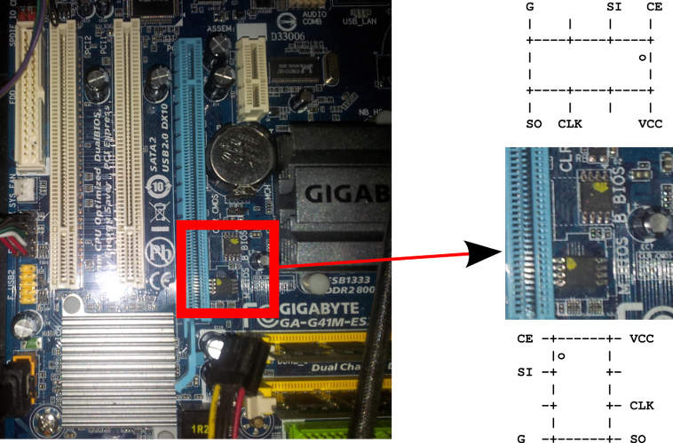

GA-G41M-ES2L flashing tutorial {#pagetop}
==============================

This guide is for those who want libreboot on their Intel GA-G41M-ES2L
motherboard while they still have the original BIOS present.

[Back to main index](./)

Flash chip size {#flashchips}
===============

Use this to find out:\
\# **flashrom -p internal -V**

[Back to top of page.](#pagetop)

Flashing instructions {#clip}
=====================

Refer to [bbb\_setup.html](bbb_setup.html) for how to set up the BBB for
external flashing. **You can only externally reprogram one of the chips
at a time, and you need to disable the chip that you\'re not flashing,
by connecting 3v3 to /CS of that chip, so you will actually need 2 test
clips (you also need to connect GND on the chip that you\'re
disabling).**

Here is an image of the flash chip:\

Internal flashing is possible. Boot with the proprietary BIOS and
GNU+Linux. There are 2 flash chips (one is backup).

Flash the first chip:\
**./flashrom -p internal:dualbiosindex=0 -w libreboot.rom**

Flash the second chip:\
**./flashrom -p internal:dualbiosindex=1 -w libreboot.rom**

NOTE: you can still boot the system with just the main flash chip
connected, after desoldering the backup chip. This has been tested while
libreboot was already installed onto the main chip.

NOTE: You need the latest flashrom. Just get it on flashrom.org from
their SVN or Git repos.

NOTE: due to a bug in the hardware, the MAC address is hardcoded in
coreboot-libre. Therefore, you must set your own MAC address in your
operating system.

Copyright © 2016 Leah Rowe &lt;info@minifree.org&gt;\
Permission is granted to copy, distribute and/or modify this document
under the terms of the Creative Commons Attribution-ShareAlike 4.0
International license or any later version published by Creative
Commons; A copy of the license can be found at
[../cc-by-sa-4.0.txt](../cc-by-sa-4.0.txt)

Updated versions of the license (when available) can be found at
<https://creativecommons.org/licenses/by-sa/4.0/legalcode>

UNLESS OTHERWISE SEPARATELY UNDERTAKEN BY THE LICENSOR, TO THE EXTENT
POSSIBLE, THE LICENSOR OFFERS THE LICENSED MATERIAL AS-IS AND
AS-AVAILABLE, AND MAKES NO REPRESENTATIONS OR WARRANTIES OF ANY KIND
CONCERNING THE LICENSED MATERIAL, WHETHER EXPRESS, IMPLIED, STATUTORY,
OR OTHER. THIS INCLUDES, WITHOUT LIMITATION, WARRANTIES OF TITLE,
MERCHANTABILITY, FITNESS FOR A PARTICULAR PURPOSE, NON-INFRINGEMENT,
ABSENCE OF LATENT OR OTHER DEFECTS, ACCURACY, OR THE PRESENCE OR ABSENCE
OF ERRORS, WHETHER OR NOT KNOWN OR DISCOVERABLE. WHERE DISCLAIMERS OF
WARRANTIES ARE NOT ALLOWED IN FULL OR IN PART, THIS DISCLAIMER MAY NOT
APPLY TO YOU.

TO THE EXTENT POSSIBLE, IN NO EVENT WILL THE LICENSOR BE LIABLE TO YOU
ON ANY LEGAL THEORY (INCLUDING, WITHOUT LIMITATION, NEGLIGENCE) OR
OTHERWISE FOR ANY DIRECT, SPECIAL, INDIRECT, INCIDENTAL, CONSEQUENTIAL,
PUNITIVE, EXEMPLARY, OR OTHER LOSSES, COSTS, EXPENSES, OR DAMAGES
ARISING OUT OF THIS PUBLIC LICENSE OR USE OF THE LICENSED MATERIAL, EVEN
IF THE LICENSOR HAS BEEN ADVISED OF THE POSSIBILITY OF SUCH LOSSES,
COSTS, EXPENSES, OR DAMAGES. WHERE A LIMITATION OF LIABILITY IS NOT
ALLOWED IN FULL OR IN PART, THIS LIMITATION MAY NOT APPLY TO YOU.

The disclaimer of warranties and limitation of liability provided above
shall be interpreted in a manner that, to the extent possible, most
closely approximates an absolute disclaimer and waiver of all liability.

